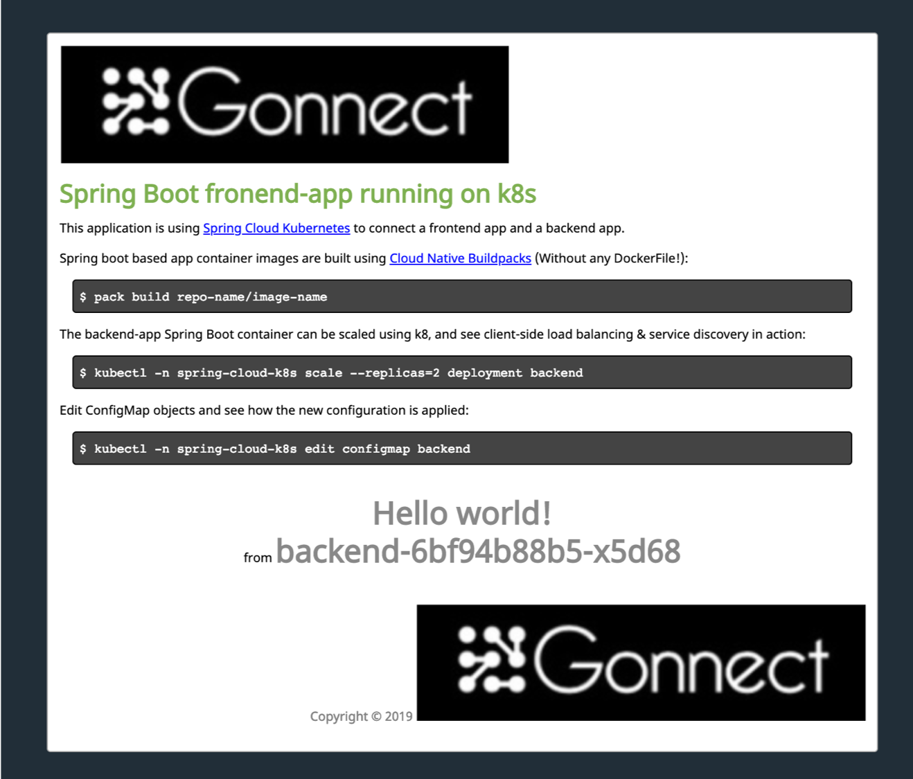

# Run Spring Boot on Kubernetes with Spring Cloud Kubernetes


This Github project demonstrates how to use [Spring Cloud Kubernetes](https://www.github.com/spring-cloud/spring-cloud-kubernetes) to execute a Spring Boot based app on Kubernetes. Spring Cloud K8s provides abstraction over K8s, as a result there is no K8s specific coding in the application code. This abstraction provides following capabilities:

1. Service Discovery

    _This project provides an implementation of Discovery Client for Kubernetes. This client lets you query Kubernetes endpoints (see services) by name. A service is typically exposed by the Kubernetes API server as a collection of endpoints that represent http and https addresses and that a client can access from a Spring Boot application running as a pod. This discovery feature is also used by the Spring Cloud Kubernetes Ribbon project to fetch the list of the endpoints defined for an application to be load balanced._

  **NOTE** Kubernetes itself is capable of (server side) service discovery. sing native kubernetes service discovery ensures compatibility with additional tooling, such as [Istio](https://istio.io), a service mesh that is capable of load balancing, ribbon, circuit breaker, failover, and much more. The caller service then need only refer to names resolvable in a particular Kubernetes cluster. A simple implementation might use a spring RestTemplate that refers to a fully qualified domain name (FQDN), such as
   ```bash
   https://{service-name}.{namespace}.svc.{cluster}.local:{service-port}
   ````
   Additionally, you can use Hystrix for:
   
   * Circuit breaker implementation on the caller side, by annotating the spring boot application class with @EnableCircuitBreaker
   
   * Fallback functionality, by annotating the respective method with @HystrixCommand(fallbackMethod)
   
2. Configuration using ConfigMap objects
3. Client-side load balancing
4. Circuit breaker patterns

This project consist of following:
1. BackendApplication
2. FrontendApplication

Both these applications will be deployed on K8s cluster.

**NOTE:** Both the above applications does not contain Dockerfile. But K8s cluster do requires containers which are deployed to the pods. This project uses [Cloud Native Buildpacks](https://buildpacks.io) to create docker images.

Following picture shows architecture:


## Code Walk through

**BackendApplication**
EnableDiscoveryClient make this service available to be discovered by frontend-app. This is achiteved by auto registration to service registry (default k8s service registry)
```java
@SpringBootApplication
@EnableDiscoveryClient
public class BackendApplication {
    public static void main(String[] args) {
        SpringApplication.run(BackendApplication.class, args);
    }
}
```

**FrontApplication**
```java
@SpringBootApplication
@EnableDiscoveryClient
public class FrontEndApplication {

    public static void main(String[] args) {
        SpringApplication.run(FrontEndApplication.class, args);
    }

    @Bean
    @LoadBalanced
    public RestTemplate restTemplate() {
        // Create a client-side load balanced REST client.
        return new RestTemplate();
    }
}
```

**BackendCallingFrontEndController**
```java
@Controller
@Slf4j
@RequiredArgsConstructor
class IndexController {
    private final RestTemplate client;
    @Value("${services.backend}")
    private String backendAddress;

    @GetMapping("/")
    public String index(Model model) {
        log.info("Calling backend: {}", backendAddress);
        final HelloResponse result = client.getForObject(backendAddress, HelloResponse.class);
        log.info("Received result from backend: {}", result);

        model.addAttribute("message", result.getMessage());
        model.addAttribute("source", result.getSource());

        return "index";
    }
}
```

The pointer to back is spcified as:
```yaml
management:
  endpoints:
    web:
      exposure:
        include: health, prometheus

services:
  # Override this property to set where the backend is located.
  backend: "http://localhost:8081"
```

## Pre-requisite
1. Docker with K8s enabled
2. buildpack.io cli
3. java8
4. maven

## Running

### Step 1

```bash
pack --path backend build mgorav/backend-app
```


### Step 2

```bash
pack --path frontend build mgorav/frontend-app
```


### Step 3

```bash
kubectl -n spring-cloud-k8s scale --replicas=3 deployment backend
```


### Step 4

```bash
kubectl -n spring-cloud-k8s get pods
```


### Verify

```bash
kubectl -n spring-cloud-k8s get svc frontend-lb
```


### Play Time
Hit the URL:

```bash
http://localhost:80
```

